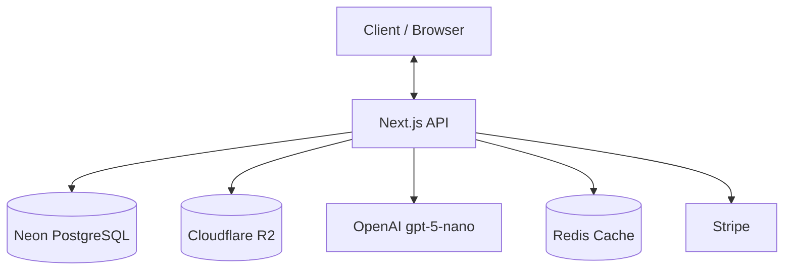
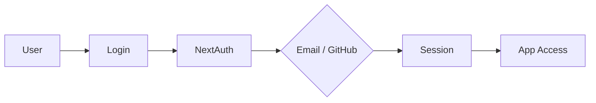
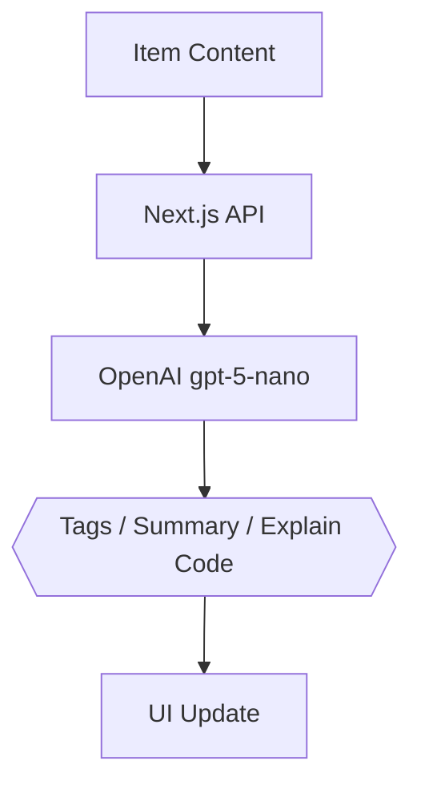

# 🚀 DevStash — Project Overview

> **Centralized Developer Knowledge Hub** for code snippets, AI prompts, docs, commands & more.
>
> **Tagline:** *Store Smarter. Build Faster.*

---

## 📌 The Problem

Developers keep their essentials scattered across too many places:

| Resource | Typically lives in… |
| --- | --- |
| Code snippets | VS Code, Notion |
| AI prompts | Chat histories |
| Context files | Buried in projects |
| Useful links | Browser bookmarks |
| Docs | Random folders |
| Commands | `.txt` files, bash history |
| Project templates | GitHub gists |

The result: **constant context switching, lost knowledge, and inconsistent workflows.**

➡️ **DevStash provides ONE searchable, AI-enhanced hub for all developer knowledge and resources.**

---

## 🧑‍💻 Target Users

| Persona | Core Needs |
| --- | --- |
| **Everyday Developer** | Quick access to snippets, commands, links |
| **AI-First Developer** | Store prompts, workflows, and contexts |
| **Content Creator / Educator** | Save course notes and reusable code |
| **Full-Stack Builder** | Patterns, boilerplates, API references |

---

## ✨ Core Features

### A) Items & System Item Types

Every stored resource is an **Item**, belonging to one built-in type:

`Snippet` · `Prompt` · `Note` · `Command` · `File` · `Image` · `URL`

> 💡 **Custom item types** are available to **Pro** users.

### B) Collections

Group items into collections — mixed item types allowed.
*Examples:* React Patterns · Context Files · Python Snippets

### C) Search

Full-text search across **content, tags, titles, and types**.

### D) Authentication

- 📧 Email + Password
- 🐙 GitHub OAuth

### E) Additional Features

- ⭐ Favorites & pinned items
- 🕒 Recently used
- 📥 Import from files
- 📝 Markdown editor for text items
- 📎 File uploads (images, docs, templates)
- 📤 Export (JSON / ZIP)
- 🌙 Dark mode (default)

### F) AI Superpowers

- 🏷️ Auto-tagging
- 📄 AI summaries
- 🧩 Explain Code
- 🎯 Prompt optimization

> AI powered by **OpenAI `gpt-5-nano`**

---

## 🗄️ Data Model (Prisma Draft)

> ⚠️ Starting point — **this schema will evolve.**

```prisma
model User {
  id                   String       @id @default(cuid())
  email                String       @unique
  password             String?
  isPro                Boolean      @default(false)
  stripeCustomerId     String?
  stripeSubscriptionId String?
  items                Item[]
  itemTypes            ItemType[]
  collections          Collection[]
  tags                 Tag[]
  createdAt            DateTime     @default(now())
  updatedAt            DateTime     @updatedAt
}

model Item {
  id           String      @id @default(cuid())
  title        String
  contentType  String      // "text" | "file"
  content      String?     // used for text-based types
  fileUrl      String?
  fileName     String?
  fileSize     Int?
  url          String?
  description  String?
  isFavorite   Boolean     @default(false)
  isPinned     Boolean     @default(false)
  language     String?

  userId       String
  user         User        @relation(fields: [userId], references: [id])

  typeId       String
  type         ItemType    @relation(fields: [typeId], references: [id])

  collectionId String?
  collection   Collection? @relation(fields: [collectionId], references: [id])

  tags         ItemTag[]

  createdAt    DateTime    @default(now())
  updatedAt    DateTime    @updatedAt

  @@index([userId])
  @@index([typeId])
  @@index([collectionId])
}

model ItemType {
  id       String  @id @default(cuid())
  name     String
  icon     String?
  color    String?
  isSystem Boolean @default(false)

  userId   String?
  user     User?   @relation(fields: [userId], references: [id])

  items    Item[]
}

model Collection {
  id          String   @id @default(cuid())
  name        String
  description String?
  isFavorite  Boolean  @default(false)

  userId      String
  user        User     @relation(fields: [userId], references: [id])

  items       Item[]
  createdAt   DateTime @default(now())
  updatedAt   DateTime @updatedAt

  @@index([userId])
}

model Tag {
  id     String    @id @default(cuid())
  name   String
  userId String
  user   User      @relation(fields: [userId], references: [id])

  items  ItemTag[]

  @@unique([userId, name])
}

model ItemTag {
  itemId String
  tagId  String

  item Item @relation(fields: [itemId], references: [id])
  tag  Tag  @relation(fields: [tagId], references: [id])

  @@id([itemId, tagId])
}
```

> **Cleanup notes:** added `@@index` on foreign keys for query performance, and a `@@unique([userId, name])` on `Tag` to prevent duplicate tags per user.

---

## 🧱 Tech Stack

| Category | Choice |
| --- | --- |
| **Framework** | [Next.js](https://nextjs.org/) (React 19) |
| **Language** | [TypeScript](https://www.typescriptlang.org/) |
| **Database** | [Neon PostgreSQL](https://neon.tech/) + [Prisma ORM](https://www.prisma.io/) |
| **Caching** | [Redis](https://redis.io/) *(optional)* |
| **File Storage** | [Cloudflare R2](https://developers.cloudflare.com/r2/) |
| **CSS / UI** | [Tailwind CSS v4](https://tailwindcss.com/) + [ShadCN](https://ui.shadcn.com/) |
| **Auth** | [NextAuth v5](https://authjs.dev/) (Email + GitHub) |
| **AI** | [OpenAI](https://platform.openai.com/) `gpt-5-nano` |
| **Payments** | [Stripe](https://stripe.com/) |
| **Deployment** | [Vercel](https://vercel.com/) *(likely)* |
| **Monitoring** | [Sentry](https://sentry.io/) *(later)* |

---

## 💰 Monetization

| Plan | Price | Limits | Features |
| --- | --- | --- | --- |
| **Free** | $0 | 50 items · 3 collections | Basic search, image uploads, no AI |
| **Pro** | **$8/mo** or **$72/yr** | Unlimited | File uploads, custom types, AI features, export |

> 💳 **Stripe** handles subscriptions, with **webhooks** syncing plan status back to the app.

---

## 🎨 UI / UX

**Principles:** Dark-mode first · Minimal, developer-friendly · Syntax highlighting for code.
**Inspiration:** Notion · Linear · Raycast.

### Layout

- Collapsible sidebar with filters & collections
- Main grid / list workspace
- Full-screen item editor

### Responsive

- Mobile drawer for the sidebar
- Touch-optimized icons and buttons

## Screenshots

Refer to the screenshots below as a base for the dashboard UI. It does not have to be exact. Use it as a reference.

@screenshots/all items and menu open.png
@screenshots/compact view.png
@screenshots/drawer open.png
@screenshots/menu closed.png

---

## 🔌 API Architecture



---

## 🔐 Auth Flow



---

## 🧠 AI Feature Flow



---

## 🗂️ Development Workflow (Course)

- **One branch per lesson** so students can follow along and compare.
- Use **Cursor / Claude Code / ChatGPT** for assistance.
- **Sentry** for runtime monitoring & error tracking.
- **GitHub Actions** *(optional)* for CI.

```bash
git switch -c lesson-01-setup
```

---

## 🧭 Roadmap

### ✅ MVP

- Items CRUD
- Collections
- Search
- Basic tags
- Free-tier limits

### 🚀 Pro Phase

- AI features
- Custom item types
- File uploads
- Export
- Billing & upgrade flow

### 🔮 Future Enhancements

- Shared collections
- Team / Org plans
- VS Code extension
- Browser extension
- Public API + CLI tool

---

## 📌 Status

- 🟡 **In planning**
- ➡️ Ready for environment setup & UI scaffolding

---

<div align="center">

🏗️ **DevStash — Store Smarter. Build Faster.**

</div>
